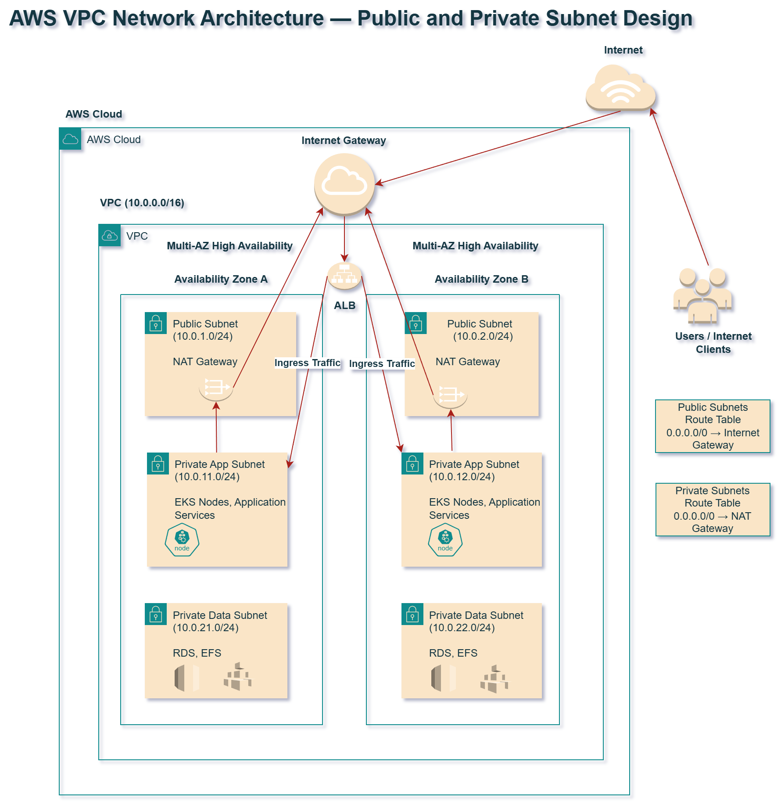
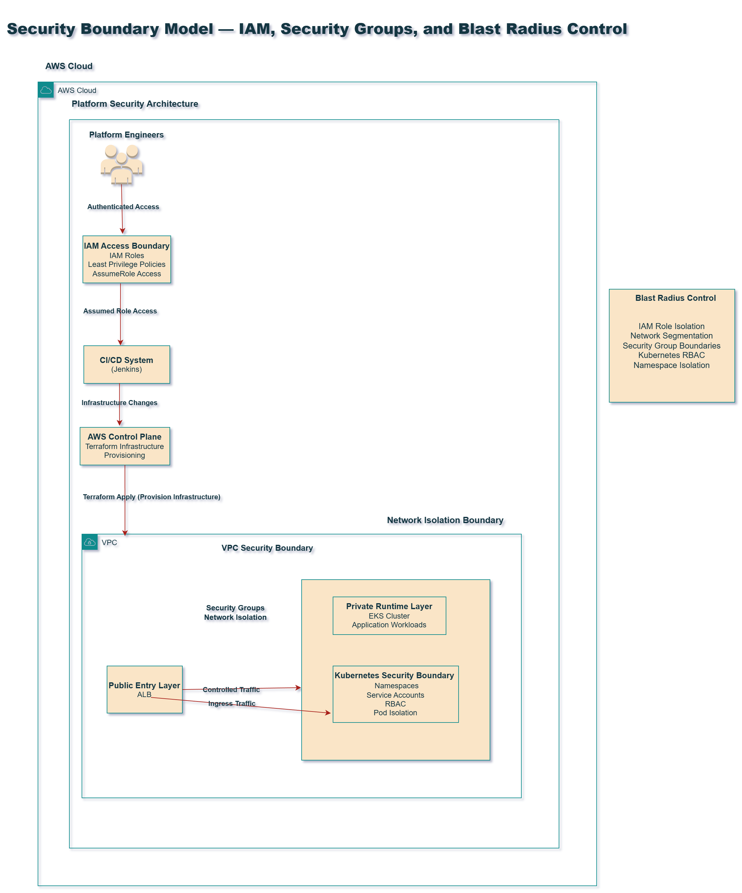

# AWS Platform Networking and Security

Production-style AWS foundation repository demonstrating secure networking, subnet segmentation, ingress design, and blast-radius control for modern platform workloads.

This repository focuses on the cloud foundation required to support reliable application and platform environments, including:

- VPC architecture
- public and private subnet segmentation
- route tables and internet access boundaries
- NAT gateway design
- ALB ingress placement
- security group strategy
- IAM access boundaries
- blast-radius control

This project complements platform provisioning, GitOps delivery, and observability work by showing how secure AWS network foundations are designed.

---

## Executive Summary

A production-ready cloud platform requires more than compute and deployment tooling.

It must also provide:

- controlled network boundaries
- secure ingress design
- workload isolation
- least privilege access patterns
- resilient multi-AZ foundations

This repository demonstrates how AWS networking and security patterns can be designed to support modern platform environments safely and predictably.

---

## Core Capabilities Demonstrated

### Networking

- VPC design
- public/private subnet segmentation
- multi-AZ layout
- route table strategy
- NAT gateway architecture

### Ingress

- Application Load Balancer placement
- controlled internet-facing entry points
- separation of public ingress from private workloads

### Security

- least privilege IAM design
- security group boundaries
- blast-radius control
- access isolation patterns

---

## Architecture Diagrams

### VPC Network Architecture

### Traffic and Ingress Flow

### Security Boundary Model

---

## Repository Structure

aws-platform-networking-and-security/
├── diagrams/
├── terraform/
├── security/
├── docs/
└── adr/

---

## Documentation

Detailed design documentation is available under `/docs`.

- VPC architecture
- subnet segmentation
- ingress and load balancing
- IAM and access boundaries
- blast-radius control
- lessons learned

---

## Why This Project Matters

Modern platform engineering depends on strong cloud foundations.

A secure AWS platform must provide:

- clear network segmentation
- private runtime isolation
- controlled ingress
- safe access boundaries
- resilient architecture across availability zones

This repository demonstrates how those design principles can be implemented as part of a production-style cloud platform foundation.

---

## Author

**Christine Adelusi**  
Senior DevOps / Platform Engineer  

AWS | VPC | IAM | ALB | Security Groups | Terraform