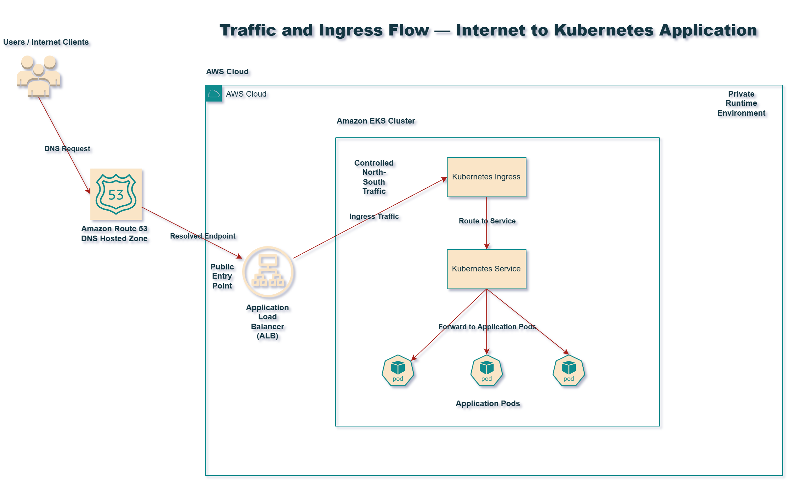

# AWS Platform Networking and Security

This repository documents the networking and security architecture used to support production-style AWS platform environments.

The focus is on designing cloud foundations that are:

- secure
- segmented
- resilient
- suitable for modern application and platform workloads

---

# Architecture Diagrams

The following diagrams illustrate the network and security design of the platform foundation.

## VPC Network Architecture

This diagram shows the multi-AZ VPC layout, including:

- public subnet placement
- private subnet placement
- NAT gateway strategy
- ALB ingress architecture
- workload isolation boundaries

---

## Traffic and Ingress Flow

This diagram illustrates how traffic enters the platform through controlled ingress points and reaches workloads without exposing runtime services directly.

---

## Security Boundary Model

This diagram shows how IAM boundaries, security groups, and subnet isolation work together to reduce blast radius and protect runtime systems.

---

# Documentation Map

## Networking Design

- [VPC Architecture](vpc-architecture.md)
- [Subnet Segmentation](subnet-segmentation.md)
- [Ingress and Load Balancing](ingress-and-load-balancing.md)

## Security Design

- [IAM and Access Boundaries](iam-and-access-boundaries.md)
- [Blast Radius Control](blast-radius-control.md)

## Operational Notes

- [Lessons Learned](lessons-learned.md)

---

# Engineering Goals

This repository demonstrates how to design AWS networking and security foundations that support:

- platform reliability
- secure workload isolation
- controlled internet ingress
- least privilege access
- scalable multi-AZ architecture